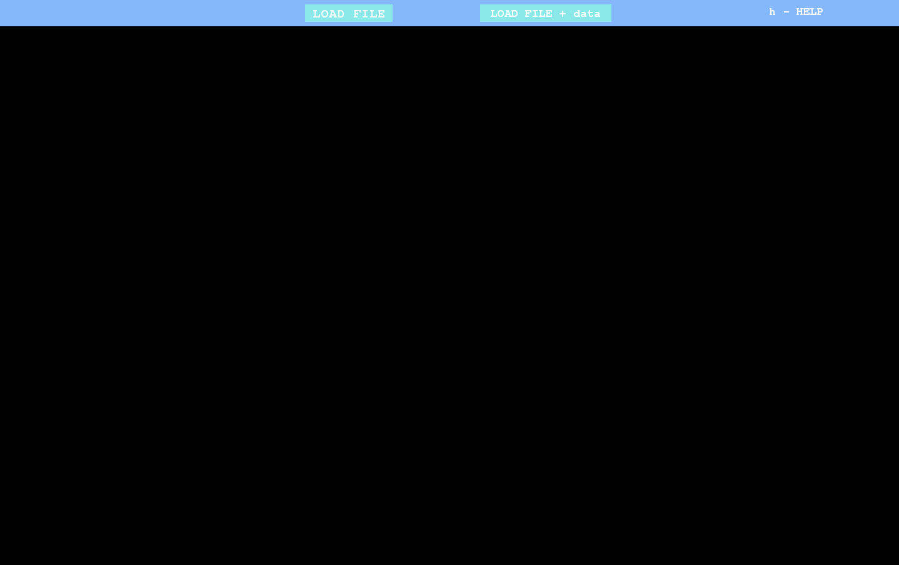
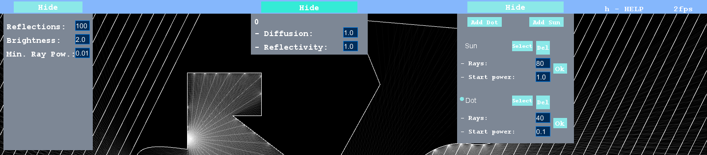
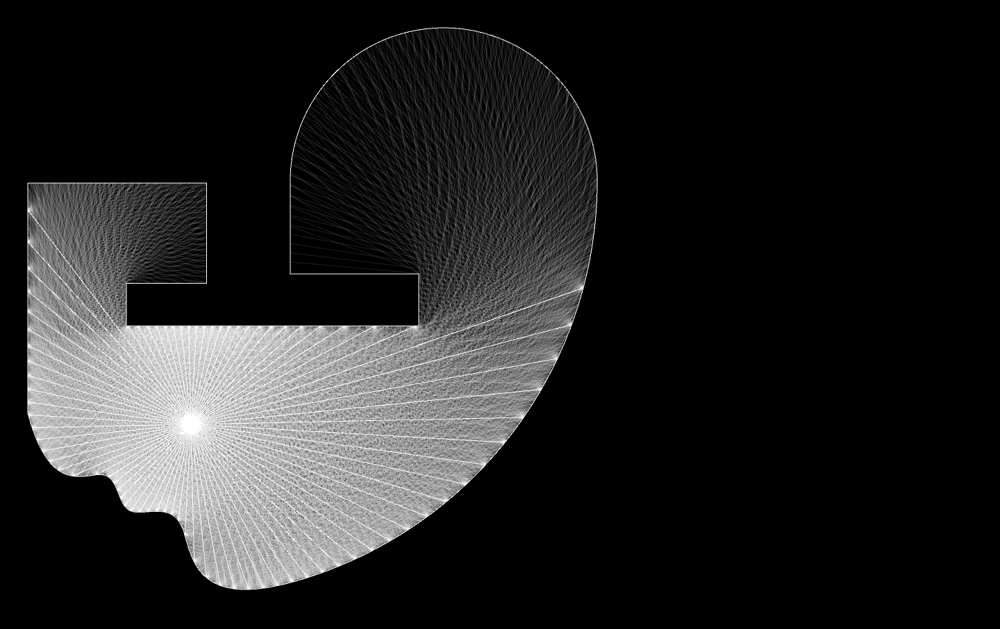
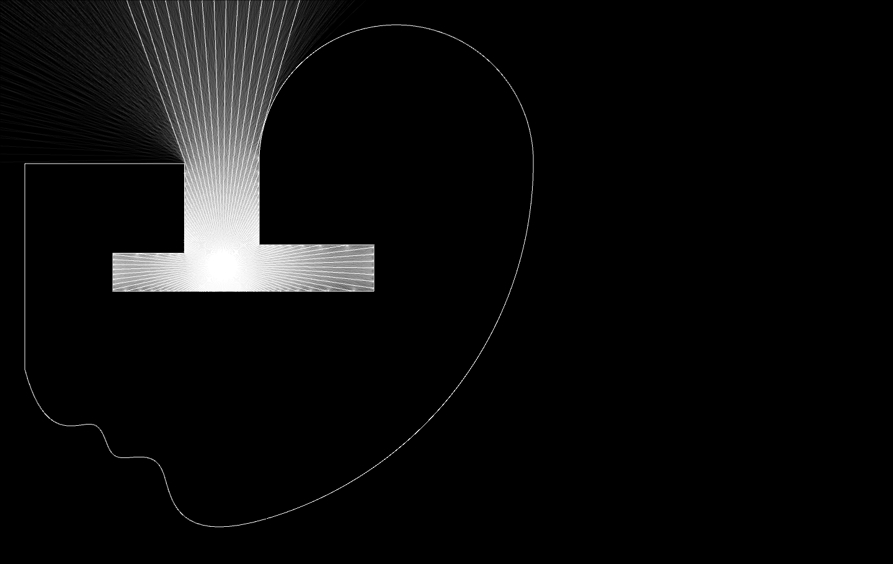
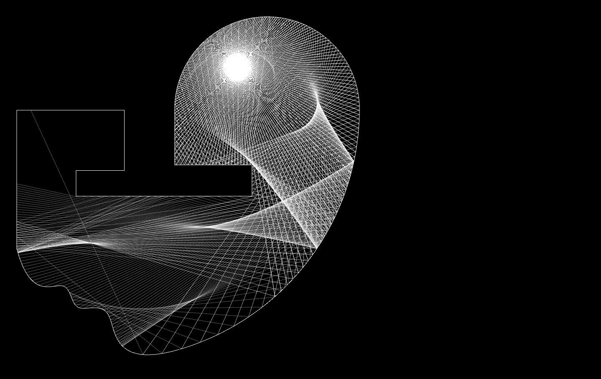
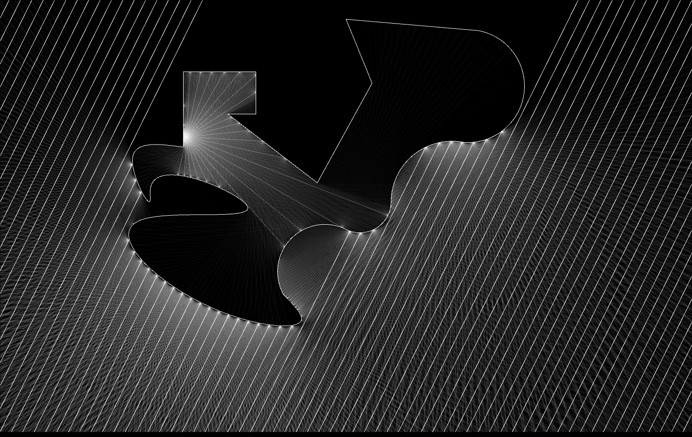

# RayCasting
  
PRZESTARZAŁA WERSJA PROGRAMU. NOWA WERSJA ZNAJDUJE SIĘ NA BRANCHU 'v3'.
  
Program napisany w Javie w środowisku graficznym Processing.  
Aby go skompilować wymagane jest środowisko.  
(Program używa biblioteki controlP5)  
    
RayCasting to program, który symuluje zachowanie świtała i jego odbić.  
Użytkownik może wprowadzić plik z figurami geometrycznymi,  
a następnie dodać źródła światła oraz skonfiguraować paramtery  
tych źródeł, jak i materiałów z których zrobione są wprowadzone krztałty.  
Następnie program narysuje promienie światła odbijające się i rozpraszające  
na powieszchniach wgranych obiektów.  
Poza tworzeniem ciekawej interaktywnej grafiki, program może być wykorzystywany  
do symulowania zachowania światła np. w pomieszczeniach jeszcze na etapie wczesnego  
projektu, zanim możliwe będzie zrobienie pomiarów.  
  
W zakładce **Releases** znajduje się instalator do pobrania  
dla 64-bitowego Windowsa.  

### Pliki wejściowe
Aplikacja obsługuje pliki DXF. (testowane na standardzie AutoCAD i Rhinoceros)  
Plik może zawierać:
* Polilinie  
* Linie  
* Łuki  
* Okręgi  
* Krzywe (B-spline)  
  
Plik może zawierać wiele warstw, każda z nich będzie miała swój materiał,  
któremu będzie można przypisać odmienne właściwości.  
Instlator umieszcza w lokalizacji aplikacji także folder  
*examples* z dwoma przykładowymi plikami DXF, na których można  
zobaczyć możliwości aplikacji.  
  
### Zapis konfiguracji
Program posiada system automatycznego zapisu ustawień.  
Dane zapisywane są w pliku o nazwie [nazwa pliku DXF]_data.json  
w lokalizacji pliku.  
Aby wczytać ostatni zapis, wystarczy na ekranie wczytywania pliku  
kliknąć "LOAD FILE + data", po czym wybrać **plik DXF**. Ustawienia zostaną  
załadowane automatycznie.  
  
### Znane błędy
* Program jest bardzo wymagający sprzętowo, na większości komputerów po jakimś  
czasie działania wyłącza się. Zawsze można jednak wczytać ostatni zapis, i pracować dalej.  
* Przyciski interfejsu urzytkownika często działają z opóźnieniem, i czasem nie  
reagują na naciśnięcie. Jest to spowodowane częstymi spadkami FPSów, co skutkuje  
mniejszą responsywnością menu.  
  
### Wygląd programu
Ekran wyboru pliku:  
  
Interface urzytkownika:  
  
Grafika generowana przez program:  
[REFLECTIONS]=100; [Difusion]=1;  
  
[REFLECTIONS]=100; [Difusion]=1;
  
[Difusion]=0; [Reflect]~0.6;
  
Ustawienia jak na grafice nr.2
  
